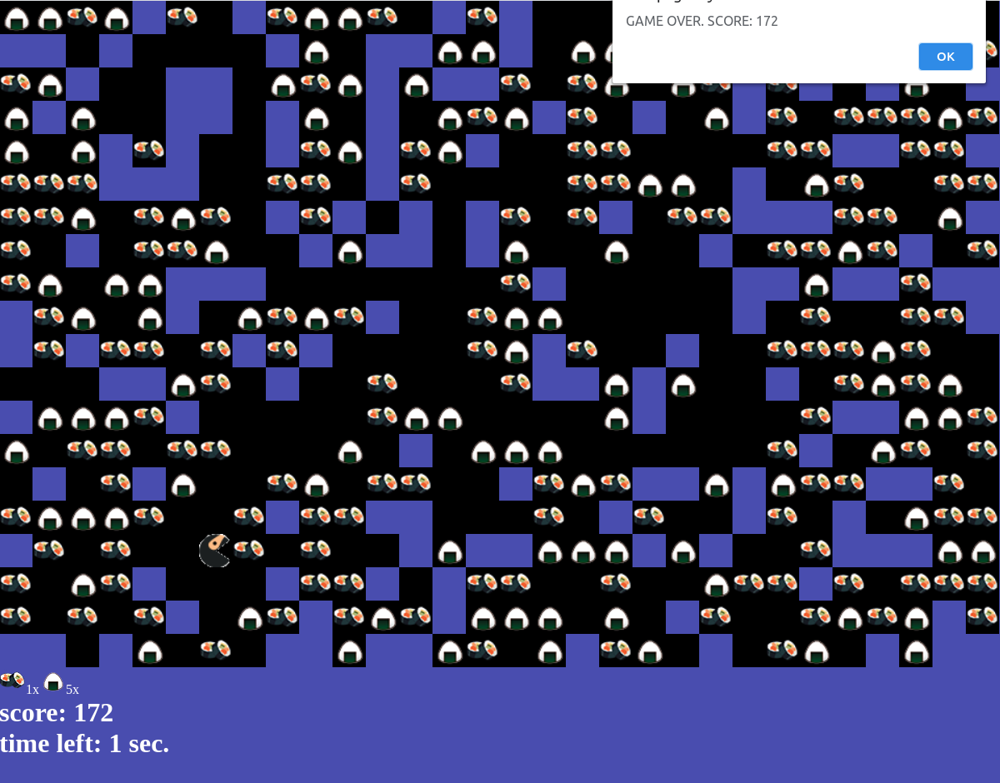

# Pacman game
Coding DOJO bootcamp project, 2d platformer game

## Getting Started
Preferable resolution: 1920x1080.
You have 15 sec. to gather max count of sushi. Move around and good luck! 🍣 

## Controls
* move ⬆️/W 
* move ➡️/D
* move ⬇️/S 
* move ⬅️/A 

## Features added
* added 20x30 random field generator
* added onigiri
* added score system
* added left wall teleport
* 15 seconds timer, and score in the end

## Author

* **IURII LYTVYN** 

## License

This project is licensed under the MIT License 

## Demo

